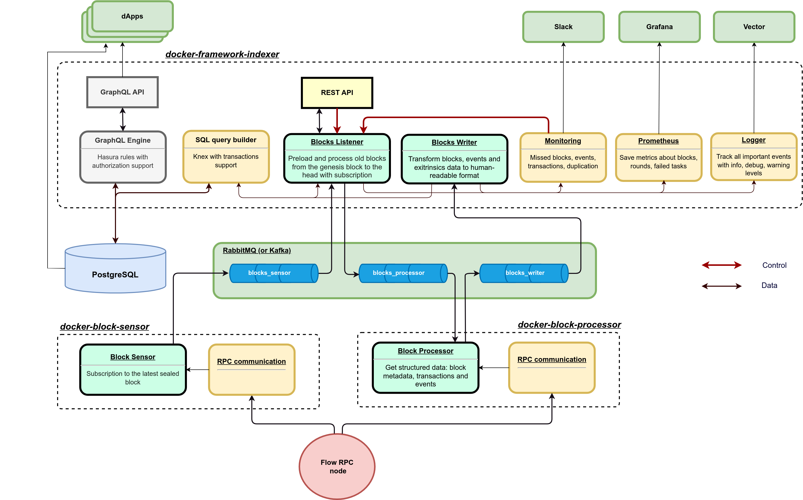

# Flow Indexer


# Introduction

Flow Indexer is the first open-source data warehouse designed to provide application-specific data for the Flow blockchain. Its purpose is to reduce costs and simplify the process of building wallets, dashboards, explorers, and dApps that interact with Flow blockchain.

# Features

- Real-time data (with a maximum delay of 20 seconds for a block to appear in the database).
- High-speed extraction (up to 1000 blocks per hour for one instance with 1 CPU and 200MB RAM).
- High scalability (100 instances can process 100K blocks per hour).
- High-speed access to extracted data (up to 10 thousand rows per second).
- Docker-compose in-house setup in 5 seconds.

# Dependencies

- Docker
- Docker Compose

# Ram requirements

- BlockSensors: 1cpu, 200MB
- BlockProcessor: 1-100cpu, 200MB
- IndexerFramework: 1cpu, 500MB
- PostgreSQL: 1cpu, 1GB
- RabbitMQ: 1cpu, 300MB

# INSTALLATION 

## Docker installation

Check the official guide: [https://docs.docker.com/engine/install/](https://docs.docker.com/engine/install/)

## Quick Start

1. Create the .env file:
```
cp .env.sample .env
```

2. Specify the RPC URL in the .env file. For example:
```
RPC_URI=https://rest-mainnet.onflow.org
```

3. Specify the block ID from which you want to start the sync. For example:
```
START_BLOCK_ID=56000000
```

4. Start the Docker containers:
```
docker-compose up -d
```

## Scalability

If you want to run 30 Block Processor instances then run it like

```
docker-compose up -d --scale flow_block_processor=30
```


# REST API

To monitor streamer status, you can use API on 3000 port

## API methods

[http://0.0.0.0:3000/health](http://0.0.0.0:3000/health) -  responds with {"status":"live"} if the system is healthy.

[http://0.0.0.0:3000/metrics](http://0.0.0.0:3000/metrics) -  provides Prometheus metrics for Grafana.

[http://0.0.0.0:3000/blocks/pause](http://0.0.0.0:3000/blocks/pause) - pauses blocks synchronization.

[http://0.0.0.0:3000/blocks/resume](http://0.0.0.0:3000/blocks/resume) - resumes blocks synchronization.

[http://0.0.0.0:3000/blocks/restart-unporcessed](http://0.0.0.0:3000/blocks/restart-unprocessed) -  restarts the extraction of all unprocessed blocks. Increase the memory of the BlockProcessor instance before calling this method if there were problems with block data extraction.

[http://0.0.0.0:3000/blocks/process/:blockId](http://0.0.0.0:3000/blocks/process/:blockId) -  manually processes the specified `blockId`.

[http://0.0.0.0:3000/blocks/process/:startBlockId/:endBlockId](http://0.0.0.0:3000/blocks/process/:startBlockId/:endBlockId) - manually processes a range of blocks from `startBlockId` to `endBlockId`.

After the preload is completed, the streamer will switch to listening for finalized blocks.

# How it works

## Project structure

```
├── db: Schema to set up a PostgreSQL database.
├── db-data: External Docker volume for PostgreSQL data.
├── docker-compose.yml: Definition of all containers (DB, RabbitMQ, BlockSensors, BlockProcessors, IndexerFramework, etc.).
├── framework: Indexer framework for controlling the indexing process (language: TypeScript).
│   ├── Dockerfile: Common Docker rules for building the Indexer Framework container.
│   └── src
│       ├── index: Main application.
│       ├── environment: Environment definition with default values.
│       ├── loaders
│       │   ├── database: PostgreSQL initializer using the Knex library.
│       │   ├── express: Express initializer for the REST API.
│       │   ├── logger: Pino logger initializer.
│       │   ├── prometheus: Prometheus metrics initializer for Grafana.
│       │   └── rabbitmq: RabbitMQ queue initializer.
│       ├── models: Database models.
│       └── modules
│           ├── index: Modules initializer depending on the MODE (specified in docker-compose.yml).
│           ├── BlockListener: Initial preloader and finalized block processor.
│           │   ├── index: Module initializer.
│           │   ├── controller: REST API endpoints.
│           │   ├── service: Base module logic (get message from BlockSensor, check it, and send it to BlockProcessor queue).
│           │   └── helpers
│           │       └── database: Methods for getting/saving data in the database.
│           ├── BlockWriter: Get block data structure from BlockProcessor and write it to the database.
│           └── Monitoring: Check missing blocks and tasks.
└── src: Main containers for fetching block data from the RPC node.
    ├── block-sensor: Python module for fetching the latest block height.
    │   ├── Dockerfile: Common Docker rules for building the Python container.
    │   └── sensor.py: Get the latest block height from the RPC node and send it to the RabbitMQ queue.
    └── block-processor: Python module for getting block data, transactions, and events from the RPC node.
        ├── Dockerfile: Common Docker rules for building the Python container.
        └── processor.py: Main script for getting structured block data from the RPC node.
```

## Architecture diagram




## Database structure

The database schema is described in the  [./db/init.sql](./db/init.sql). This file is used as the entrypoint SQL when Postgres is started using the ./db/Dockerfile defined in the ./docker-compose.yml file.

The schema includes the following tables:

- blocks: This table stores information about blocks, including block height, block ID, parent ID, block time, and parent voter signature.

- events: This table stores information about events, including block height, event ID, transaction ID, transaction index, event index, type, and payload.

- transactions: This table stores information about extrinsics, including block height, block ID, transaction ID, script, arguments, reference block ID, gas limit, payer, proposal key, authorizers, payload signatures, envelope signatures, execution, status, status code, error message, and computation used.

- processing_tasks: This table stores information about processing tasks, including network ID, entity, entity ID, status, collection unique ID, start time, finish time, data, attempts, and a unique identifier (row_id).

- processing_state: This table stores information about the processing state, including network ID, entity, entity ID, and a unique identifier (row_id). It also has a constraint to ensure a unique combination of entity and network ID.

- processing_metrics: This table stores information about processing metrics, including delay_time_ms, process_time_ms, missed_count, duplicates_count, rpc_sync_diff_count, memory_usage_mb, not_processed_count, and restart.

Please refer to the [./db/init.sql](./db/init.sql)  file for the detailed schema definition.


## Indexer SLI metrics

These metrics provide insights into the speed, data quality, and system performance of the indexer.

1. Speed:
      - *delay_time_ms*: The time it takes for a block to appear in the blockchain and be found in the database, measured in milliseconds.
      - *process_time_ms*: The time it takes to process a block, measured in milliseconds.
2. Data Quality:
      - *missed_count*: The number of missed blocks, indicating blocks that were not successfully processed or recorded.
      - *duplicates_count*: The number of duplicate records, indicating instances where the same data has been recorded multiple times.
      - *rpc_sync_diff_count*: The difference between the data in the RPC (Remote Procedure Call) and the data stored in the database.
3. System:
      - *memory_usage_mb*: The amount of memory used for processing each task, measured in megabytes.
      - *not_processed_count*: The number of unprocessed tasks, indicating tasks that have not been completed.
      - *restart*: The count of indexer restarts, indicating the number of times the indexer has been restarted.